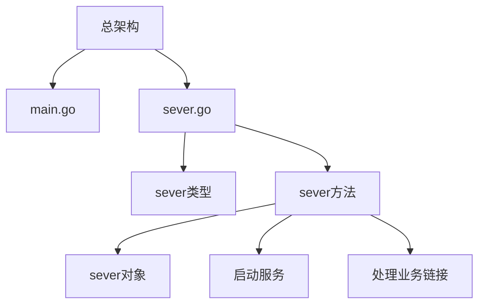

# 各版本的架构示意图
## 学习建议

1. 在这个项目中 可以学习一下net包的使用

## 版本一
该版本设计类基础的

```mermaid
graph TD;
	总架构-->main.go
	总架构-->sever.go
	sever.go-->sever类型
	sever.go-->sever方法
	sever方法-->sever对象
	sever方法-->启动服务
	sever方法-->处理业务链接
```

